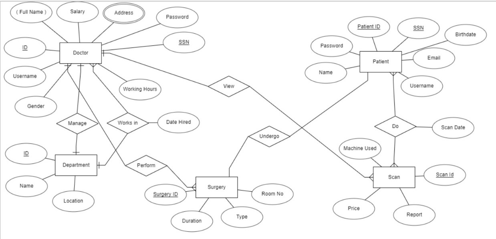

# 𝐌𝐞𝐝𝐒𝐜𝐚𝐧𝐒𝐮𝐫𝐠 𝐂𝐨𝐧𝐧𝐞𝐜𝐭 🌐💻

**MedScanSurg Connect** streamlines and empowers patients, providing a user-friendly portal for scheduling scans, radiology & surgery appointments, and surgeries, fostering efficient healthcare access and choices. This project is a Flask-based web application for managing a Radiology & Surgery Department database. It allows users to login as patients, doctors, or administrators, schedule appointments, and manage user profiles.

## 🎥 [Watch the Demo Video](https://drive.google.com/file/d/1XUMfUSOsbVn4jWmsddq0c2hgfBW1Q-fT/view?usp=sharing)


## Table of Contents
1. [Project Overview](#project-overview)
2. [Project Structure](#project-structure)
3. [Routes and Functions](#routes-and-functions)
4. [Additional Functions](#additional-functions)
5. [Running the Flask App](#running-the-flask-app)
6. [How to Contribute](#how-to-contribute)
7. [Contact](#contact)


## Project Overview
**MedScanSurg Connect** is a comprehensive full-stack web application designed to cater to the unique needs of the Radiology & Surgery Department. Developed using front-end technologies such as HTML, CSS, and JS, coupled with the Python Flask web micro framework, this project aims to provide a dynamic and responsive system. The application seamlessly integrates essential features of a Hospital Information System (HIS), specifically tailored for the Radiology & Surgery Department.

## Planning


## Entity Relationship Model



## Project Structure

- `website`: Contains the main Flask application.
  - `__init__.py`: Initializes the Flask app.
  - `models.py`: Defines the database models.
  - `views.py`: Contains the main views and routes.

- `static`: Contains static files (CSS, JS, images).
  - `profile_pics`: Stores user profile pictures (for patients and Doctors).
  - `scans`: Stores scans uploaded by doctors.
  - ...

- `templates`: Contains HTML templates for rendering pages.
  - `admin.html`: Admin dashboard.
  - `appointments.html`: Appointments page.
  - `doctor.html`: Doctor dashboard.
  - `index.html`: Home page.
  - `login.html`: Login and registration page.
  - `patient.html`: Patient dashboard.
  - ...

- `instance`: Contains instance-specific configuration files.

- `database.db`: SQLite database file.


## Routes and Functions

1. **🏠 Home Page:**
    - Route: `/`
    - Function: `index`

2. **🔐 Login:**
    - Route: `/login`
    - Function: `login`

3. **👨‍⚕️ Doctor Profile:**
    - Route: `/doctor/<int:doctor_id>`
    - Function: `doctor`

4. **📄 Scan Details:**
    - Route: `/scan_detail/<int:scan_id>`
    - Function: `scan_detail`

5. **👀 View Patient Information:**
    - Route: `/view_patient_info/<int:patient_id>`
    - Function: `view_patient_info`

6. **👩‍⚕️ Patient Dashboard:**
    - Route: `/patient/<int:patient_id>`
    - Function: `patient`

7. **🔄 Get Doctors (AJAX):**
    - Route: `/get_doctors`
    - Function: `get_doctors`

8. **📊 Admin Dashboard:**
    - Route: `/admin`
    - Function: `admin`

9. **✏️ Edit Doctor's Profile:**
    - Route: `/edit_doctor/<int:doctor_id>`
    - Function: `edit_doctor`

10. **🗑️ Delete Doctor:**
    - Route: `/delete_doctor/<int:doctor_id>`
    - Function: `delete_doctor_route`


## Additional Functions

1. ### ✏️ Editing a Doctor's Profile

To edit a doctor's profile, visit the `/edit_doctor/<doctor_id>` route. The admin can manage doctors' information, including their profile pictures.

2. ### ➕ Adding a New Doctor

To add a new doctor, go to the `/admin` route and fill in the required information in the form.

3. ### 📅 Managing Appointments

Patients can schedule appointments by visiting the `/appointments/<patient_id>` route. Doctors and administrators can view and manage appointments.

4. ### 📄 Adding Scan

To add a new scan, visit the `/add_scan` route. Doctors can upload scans for further analysis.

5. ### 👀 Showing Patient Info

To view detailed information about a patient, go to the `/view_patient_info/<patient_id>` route. Access patient records and history.

6. ### 🏥 Choosing a Surgery Doctor

Patients can choose a surgery doctor by visiting the `/choose_surgery_doctor` route. Select a doctor and schedule surgery appointments.


## Running the Flask App

1. Open a terminal and navigate to the project directory:

   ```bash
   cd C:\your_path\MedScanSurg-Connect
   ```

2. If you don't have a virtual environment, create one:

   ```bash
   virtualenv venv
   ```

3. Activate the virtual environment:

   ```bash
   venv\Scripts\activate
   ```

4. Install the required packages:

   ```bash
   pip install -r requirements.txt
   ```

5. Run the Flask app:

   ```bash
   python app.py
   ```
   
## How to Contribute

1. Fork the repository.
2. Clone the forked repository to your local machine.
3. Create a new branch for your feature or bug fix: `git checkout -b feature/your-feature-name` or `git checkout -b bugfix/your-bugfix-name`.
4. Make changes and commit them: `git commit -m "Your message here"`.
5. Push the changes to your fork: `git push origin feature/your-feature-name` or `git push origin bugfix/your-bugfix-name`.
6. Create a pull request in the original repository.

## Contact

For inquiries or issues, please contact [Mahmoud Mansy] at [mmansy132003@gmail.com].

Happy coding!
